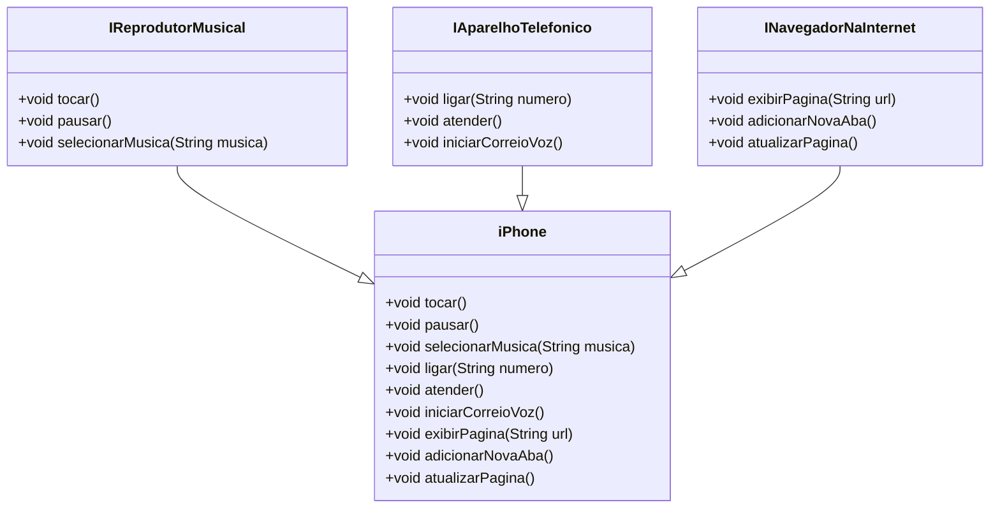

modelagem_diagramacao_UML_iPhone

```mermaid
classDiagram
    class IReprodutorMusical {
        +void tocar()
        +void pausar()
        +void selecionarMusica(String musica)
    }
    
    class IAparelhoTelefonico {
        +void ligar(String numero)
        +void atender()
        +void iniciarCorreioVoz()
    }
    
    class INavegadorNaInternet {
        +void exibirPagina(String url)
        +void adicionarNovaAba()
        +void atualizarPagina()
    }
    
    class iPhone {
        +void tocar()
        +void pausar()
        +void selecionarMusica(String musica)
        +void ligar(String numero)
        +void atender()
        +void iniciarCorreioVoz()
        +void exibirPagina(String url)
        +void adicionarNovaAba()
        +void atualizarPagina()
    }
    
    IReprodutorMusical --|> iPhone
    IAparelhoTelefonico --|> iPhone
    INavegadorNaInternet --|> iPhone
```

